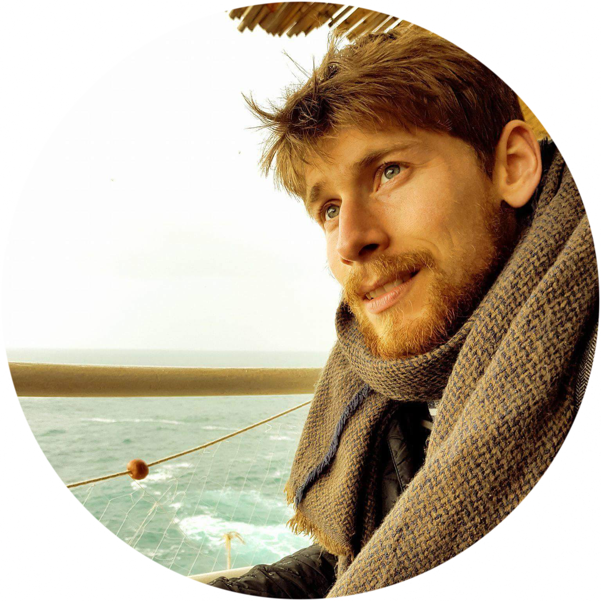

```{r, include=FALSE}
# ALWAYS DELETE THE DDCV_CACHE.rds before knitting
knitr::opts_chunk$set(
  results='asis', 
  echo = FALSE
)

library(magrittr) # For the pipe
source("cv_printing_functions.r")

# Read in all data and initialize a CV printer object
CV <- create_CV_object(
  data_location = "https://docs.google.com/spreadsheets/d/1RkOXOZUApv2uD2oUPZiC0UeUKgLT6qitAXnKv8FxpGs/edit?usp=sharing",  
  pdf_mode = params$pdf_mode,
  #cache_data = params$cache_data
)
```


```{r}
# When in pdf export mode the little dots are unaligned, so fix that with some conditional CSS.
if(params$pdf_mode) {
    cat("
<style>
:root{
  --decorator-outer-offset-left: -6.5px;
}
</style>")
}
```


Aside
================================================================================

```{r}
# Build interactive network of positions colored by section
# and connected if they occurred in the same year
#datadrivencv::build_network_logo(CV$entries_data)

```


```{r}
#if(params$pdf_mode){
#  cat("View this CV online with links at _nickstrayer.me/cv/_")
#} else {
#  cat("[<i class='fas fa-download'></i> Download a PDF of this #CV](https://github.com/nstrayer/cv/raw/master/strayer_cv.pdf)")
#}
```

Contact {#contact}
--------------------------------------------------------------------------------

```{r}
CV %>% print_contact_info()
```


Skills {#skills}
--------------------------------------------------------------------------------

```{r}
CV %>% print_skill_bars()
```


Disclaimer {#disclaimer}
--------------------------------------------------------------------------------

Made with the R package [**pagedown**](https://github.com/rstudio/pagedown). 

Last updated on `r Sys.Date()`.


Main
================================================================================

Benjamin Cretois {#title}
--------------------------------------------------------------------------------

```{r}
# Note the special double pipe so we modify the CV object in place
CV %<>% print_text_block("intro") 
```


Education {data-icon=graduation-cap data-concise=true}
--------------------------------------------------------------------------------

```{r}
CV %<>% print_section('education')
```


Research Experience {data-icon=laptop}
--------------------------------------------------------------------------------

```{r}
CV %<>% print_section('research_positions')
```


Professional Experience {data-icon=suitcase}
--------------------------------------------------------------------------------

::: aside
```{r}
# CV %<>% print_text_block('industy_experience_aside')
```
:::

```{r}
CV %<>% print_section('professional_positions')
```

<!-- These breaks just force a new page so section doesnt get cut off -->
<br>
<br>
<br>

Teaching Experience {data-icon=chalkboard-teacher}
--------------------------------------------------------------------------------

::: aside
```{r}
CV %<>% print_text_block('teaching_experience_aside')
```
:::

```{r}
CV %<>% print_section('teaching_positions')
```


Selected Scientific Communication Writing {data-icon=chart-line}
--------------------------------------------------------------------------------

::: aside
```{r}
CV %<>% print_text_block('data_science_writing_aside')
```
:::

```{r}
CV %<>% print_section('data_science_writings')
```

Selected Publications {data-icon=book}
--------------------------------------------------------------------------------

```{r}
CV %<>% print_section('academic_articles')
```


```{r}
CV %<>% print_links()
```

Selected Talks {data-icon=comment}
--------------------------------------------------------------------------------

```{r}
CV %<>% print_section('talks')
```


```{r}
CV %<>% print_links()
```